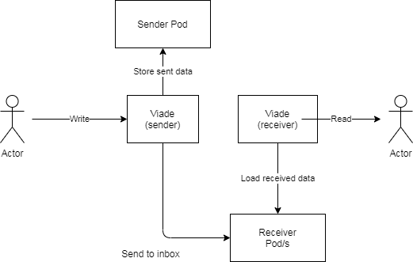

[[section-system-scope-and-context]]
== System Scope and Context

[role="arc42help"]
****
.Contents
System scope and context - as the name suggests - delimits your system (i.e. your scope) from all its communication partners
(neighboring systems and users, i.e. the context of your system). It thereby specifies the external interfaces.

If necessary, differentiate the business context (domain specific inputs and outputs) from the technical context (channels, protocols, hardware).

.Motivation
The domain interfaces and technical interfaces to communication partners are among your system's most critical aspects. Make sure that you completely understand them.

.Form
Various options:

* Context diagrams
* Lists of communication partners and their interfaces.
****

The scope of our project is a website where the users can create, explore and share routes without the related data being stored on a third-party server. So, a sharing website where all the shared data belongs to the private server of each user making use of SOLID. 

Each user will be able to create new routes using a map form OpenStreetMap or importing it from a text file, save them on their PODs and share them with other users, publicly (to all the users) or privately (to concrete users).
The shared routes will have descriptions, categories and tags so other users can search them easily through the use of diverse filters. Clients will also be able to comment and rate those public routes. 
Users can befriend others users and join groups, building on that social side they will be able to select friends and groups to share their routes with.

The application will be able to load and show routes made with other apps as well as exporting routes to those external formats simplifying the integration with those similar apps.

=== Business Context

[role="arc42help"]
****
.Contents
Specification of *all* communication partners (users, IT-systems, ...) with explanations of domain specific inputs and outputs or interfaces.
Optionally you can add domain specific formats or communication protocols.

.Motivation
All stakeholders should understand which data are exchanged with the environment of the system.

.Form
All kinds of diagrams that show the system as a black box and specify the domain interfaces to communication partners.

Alternatively (or additionally) you can use a table.
The title of the table is the name of your system, the three columns contain the name of the communication partner, the inputs, and the outputs.
****

A user can store routes of varius types that will be kept in his POD. He can also share the routes
and other type of files with his friends

	* Regular user: Stores his own routes.
	* Sender: Sends multimedia or files to other user
	* Receiver user: Receives multimedia or files from other user.
	* Pod: Each user has a POD where the routes and the shared information are stored.
	* Viade: Decentralized application to store routes and share with other people.

**<Diagram>**

// **<optionally: Explanation of external domain interfaces>**

=== Technical Context

[role="arc42help"]
****
.Contents
Technical interfaces (channels and transmission media) linking your system to its environment. In addition a mapping of domain specific input/output to the channels, i.e. an explanation with I/O uses which channel.

.Motivation
Many stakeholders make architectural decision based on the technical interfaces between the system and its context. Especially infrastructure or hardware designers decide these technical interfaces.

.Form
E.g. UML deployment diagram describing channels to neighboring systems,
together with a mapping table showing the relationships between channels and input/output.

****

The descentralized server system of the application will make use of SOLID storing all the user's data on their respective PODs. This will be integrated through the use of React, which will be the library of Javascript used to make all the interfaces of the application. An important key in the interaction and manageability of the web when communicating with the users will be the maps, which will be offered making use of OpenStreetMaps API.