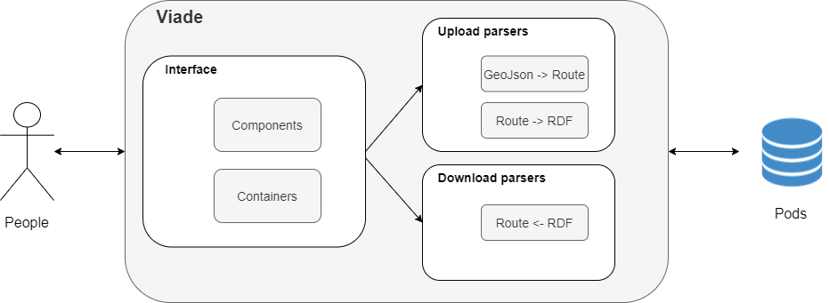

[[section-building-block-view]]

== Building Block View

This section is a decomposition of our system into diagrams. Each level is more specific than the previous one.

=== Level 1

Level 1 shows us a global vision of the project.

image:images/05_Level1.PNG["General View"]

.Level 1 descriptions
|===
|Name |Responsibility

|Pod 
|Description in the glossary

|Viade
|Our Application
|===

=== Level 2

Level 2 shows us a global vision about project architecture.

.Level 2 descriptions
|===
|Name |Responsibility

|Components and Containters
|Generate the code to show the page using React

|GeoJson -> Route
|We transform de GeoJson into an object Route in order to make route managment easier from our app.

|Route -> RDF
|We transform de object Route into RDF to be able to upload it to a Solid Pod.

|Route <- RDF
|We download RDF object and transform it into object Route to show it.
|===
