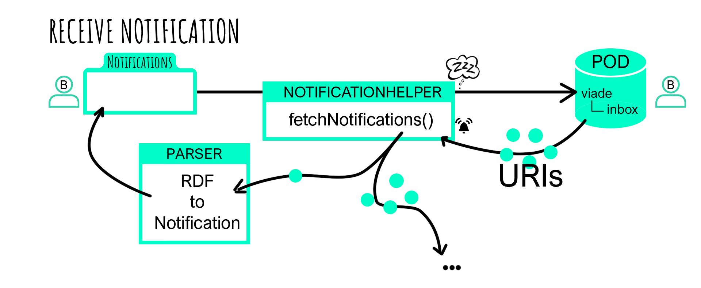

[[section-runtime-view]]
== Runtime View

Here are some Scenarios to understand how Viade works

=== Log in

This is a general view of the access to the web

image:06_LogIn.png["Log in"]

=== Upload a Route

This is a general view of the process to upload a route

image:06_UploadRoute.png["Upload Routes"]

=== Load your Routes

This is a general view of how the routes are loaded from the POD

image:06_LoadRoutes.png["Load Routes"]

=== Display a Route

This is a general view of how the Route are loaded to be displayed

image:06_DisplayRoute.png["Display your Routes"]

=== Send a Notification

This is a general view of how the Routes are shared

image:06_SendNotification.png["Send Notification"]

=== Receive a Notification

This is a general view of how incoming Notifications are handled

