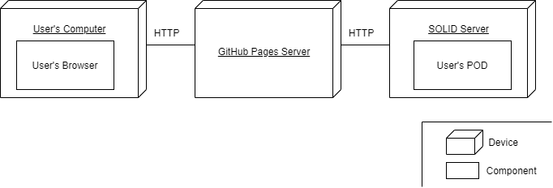

[[section-deployment-view]]

=== Infrastructure Level 1

As Viade is a decentralized browser application, we only need 3 elements per user:

* The user's computer. Which must have a browser to access the application. We recommend using Google Chrome as other browsers like Internet Explorer may not have all the JavaScript functionalities used to run the application. This also means that the user does not need a very powerful computer, just Internet conexion.
* The SOLID's server. Here is where the user's POD is. All the routes and multimedia data are stored in the POD. Thanks to the SOLID de-centralized authentication mechanisms it is not necesary to have a central server for the signing up/login process.
* The GitHub Pages server. This will be the Web Hosting Service for the application.

Motivation::

We think choosing a browser application is a good way to be open to more public, as some clients would rather access to the application online than having to install a desktop application. Moreover, being a de-centralized application can appeal clients who only want to store their routes somewhere instead of sharing them online, in this way, we can satisfy both types of clients (the ones who want to share routes and the ones wo want to keep them).

=== Infrastructure Level 2

* Solid POD: This is a personal storage space where you caan decide which things are public and private and who can see them (people, apps...). 
* GitHub Pages: Theese are public webpages hosted and published through GitHub. They can be managed via the web or locally in a computer.