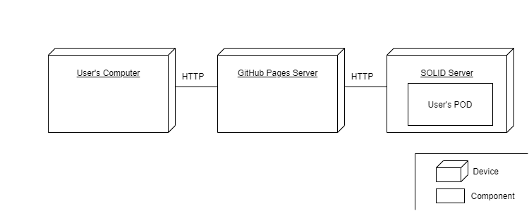

[[section-deployment-view]]

== Deployment View

[role="arc42help"]
****
.Content
The deployment view describes:

 1. the technical infrastructure used to execute your system, with infrastructure elements like geographical locations, environments, computers, processors, channels and net topologies as well as other infrastructure elements and

2. the mapping of (software) building blocks to that infrastructure elements.

Often systems are executed in different environments, e.g. development environment, test environment, production environment. In such cases you should document all relevant environments.

Especially document the deployment view when your software is executed as distributed system with more then one computer, processor, server or container or when you design and construct your own hardware processors and chips.

From a software perspective it is sufficient to capture those elements of the infrastructure that are needed to show the deployment of your building blocks. Hardware architects can go beyond that and describe the infrastructure to any level of detail they need to capture.

.Motivation
Software does not run without hardware.
This underlying infrastructure can and will influence your system and/or some
cross-cutting concepts. Therefore, you need to know the infrastructure.

.Form

Maybe the highest level deployment diagram is already contained in section 3.2. as
technical context with your own infrastructure as ONE black box. In this section you will
zoom into this black box using additional deployment diagrams:

* UML offers deployment diagrams to express that view. Use it, probably with nested diagrams,
when your infrastructure is more complex.
* When your (hardware) stakeholders prefer other kinds of diagrams rather than the deployment diagram, let them use any kind that is able to show nodes and channels of the infrastructure.
****

As Viade is a decentralized browser application, we only need 3 elements per user:

* The user's computer. Which must have a browser to access the application. We recommend using Google Chrome as other browsers like Internet Explorer may not have all the JavaScript functionalities used to run the application. This also means that the user does not need a very powerful computer, just Internet conexion.
* The SOLID's server. Here is where the user's POD is. All the routes and multimedia data are stored in the POD. Thanks to the SOLID de-centralized authentication mechanisms it is not necesary to have a central server for the signing up/login process.
* The GitHub Pages server. This will be the Web Hosting Service for the application.

Motivation::

We think choosing a browser application is a good way to be open to more public, as some clients would rather access to the application online than having to install a desktop application. Moreover, being a de-centralized application can appeal clients who only want to store their routes somewhere instead of sharing them online, in this way, we can satisfy both types of clients (the ones who want to share routes and the ones wo want to keep them).
